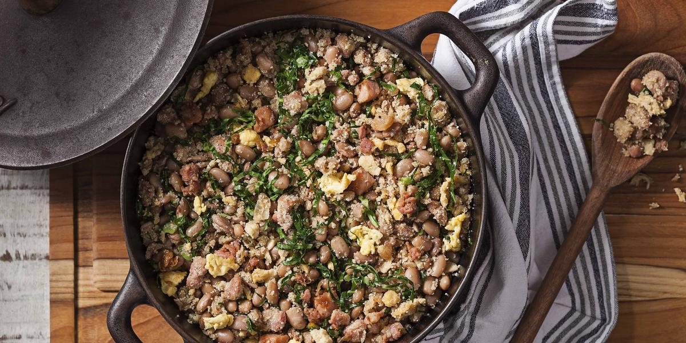

# Feijão Tropeiro

## Ingredientes

- 2 xícaras (chá) de feijão-preto
- 1 folha de louro
- 2 colheres (sopa) de bacon picado
- 2 gomos de linguiça calabresa fresca
- 2 dentes de alho amassados
- 1 cebola grande picada
- 3 ovos
- 1 tablete de MAGGI Caldo Costela
- 5 folhas de couve picadas
- 1 e meia xícara (chá) de farinha de mandioca crua

## Modo de Preparo

1. Em uma panela, cozinhe o feijão em água com o louro até que os grãos estejam macios (sem desmanchar).

2. Escorra a água e despreze o louro.

3. Em uma panela frite o bacon e a linguiça.

4. Escorra o excesso de gordura, junte o alho e a cebola e deixe refogar.

5. Adicione os ovos e mexa até que estejam cozidos. Junte o feijão, o **MAGGI** Caldo dissolvido em meia xícara (chá) de água quente e a couve.

6. Misture bem e deixe cozinhar para tomar gosto.

7. Acrescente a farinha, misturando bem e sirva a seguir.